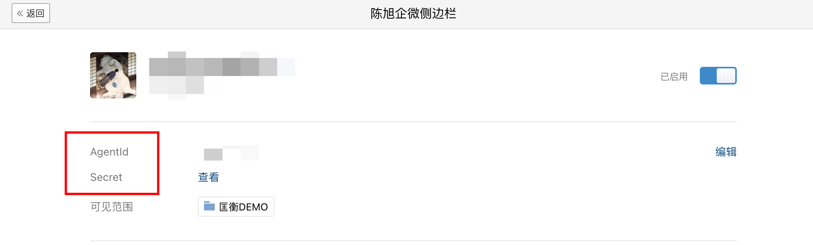

# 企微自建应用

## 创建应用

1. 登录[企微后台](https://work.weixin.qq.com/wework_admin/loginpage_wx?from=myhome)

2. 选择应用管理，在自建一栏点击创建应用

    

    

3. 根据项目需求配置

 

## 配置

点击应用图标进入应用配置

其中：

-   `AgentId`和`Secret` 一般用于服务端使用，用于向企微请求配置信息和用户信息



-   配置到聊天工具栏为配置对应页面（一个应用可配置多个页面）

      

-   网页授权及 JS-SDk 为配置`OAuth2.0网页授权功能的回调域名`和`调用JS-SDK、跳转小程序的可信域名`

    > 注意：配置网页授权功能的回调域名时需要下载对应 txt 文件放在域名对应的服务器根目录下，并且能通过域名访问到该 txt 文件。域名必须是备案过的

-   企业可信 IP，用于配置服务器 IP，因为服务器端会有请求企微的接口的情况


## 使用

1. 在`index.html` 中引入`JS-SDK`

    ```html
    <script src="//res.wx.qq.com/open/js/jweixin-1.2.0.js"></script>
    <script src="https://open.work.weixin.qq.com/wwopen/js/jwxwork-1.0.0.js"></script>
    ```

2. 通过 config 接口注入权限验证配置

    ```javascript
    wx.config({
        beta: true, // 必须这么写，否则wx.invoke调用形式的jsapi会有问题
        debug: true, // 开启调试模式,调用的所有api的返回值会在客户端alert出来，若要查看传入的参数，可以在pc端打开，参数信息会通过log打出，仅在pc端时才会打印。
        appId: "", // 必填，企业微信的corpID，必须是本企业的corpID，不允许跨企业使用
        timestamp: "", // 必填，生成签名的时间戳
        nonceStr: "", // 必填，生成签名的随机串
        signature: "", // 必填，签名，见 附录-JS-SDK使用权限签名算法
        jsApiList: [] // 必填，需要使用的JS接口列表，凡是要调用的接口都需要传进来
    })
    ```

    > config 信息验证后会执行 ready 方法，所有接口调用都必须在 config 接口获得结果之后，config 是一个客户端的异步操作，所以如果需要在页面加载时就调用相关接口，则须把相关接口放在 ready 函数中调用来确保正确执行。对于用户触发时才调用的接口，则可以直接调用，不需要放在 ready 函数中。

    > config 信息验证失败会执行 error 函数，如签名过期导致验证失败，具体错误信息可以打开 config 的 debug 模式查看，也可以在返回的 res 参数中查看，对于 SPA 可以在这里更新签名。

    > `jsApiList` 这个字段要把需要调用接口都写上

3. 在 ready 方法里通过 agentConfig 注入应用的权限

    ```javascript
    wx.agentConfig({
        corpid: '', // 必填，企业微信的corpid，必须与当前登录的企业一致
        agentid: '', // 必填，企业微信的应用id （e.g. 1000247）
        timestamp: , // 必填，生成签名的时间戳
        nonceStr: '', // 必填，生成签名的随机串
        signature: '',// 必填，签名，见附录-JS-SDK使用权限签名算法
        jsApiList: ['selectExternalContact'], //必填，传入需要使用的接口名称
    	success: function(res) {
            // 回调
        },
        fail: function(res) {
            if(res.errMsg.indexOf('function not exist') > -1){
                alert('版本过低请升级')
            }
        }
    });
    ```

    > [注意事项看文档](https://developer.work.weixin.qq.com/document/path/94313)

4. agentConfig 成功后就可以再页面调用客户端 API 了，具体调用查看[文档](https://developer.work.weixin.qq.com/document/path/90513)

## 参考代码

```javascript
// 防止ts提示 类型“Window & typeof globalThis”上不存在属性“wx”
declare global {
  interface Window {
    wx: any;
  }
}

import { getAppSignature, getEnterpriseSignature } from "@/api/weixin";
import {
  ConfigInterFace,
  NewsInterFace,
  MiniprogramInterFace,
  MessageInterFace,
} from "./interface";

class jWeiXin {
  private wx = window.wx;
  private url = location.href.split("#")[0];
  constructor() {
    this.init();
  }
  async init() {
    const { data } = await this.getEnterpriseSignature();
    this.setConfig(data as ConfigInterFace);
  }

  // 企业config
  setConfig(data: ConfigInterFace) {
    const { corpId, nonceStr, signature, timestamp } = data;
    this.wx.config({
      beta: true, // 必须这么写，否则wx.invoke调用形式的jsapi会有问题
      debug: false, // 开启调试模式,调用的所有api的返回值会在客户端alert出来，若要查看传入的参数，可以在pc端打开，参数信息会通过log打出，仅在pc端时才会打印。
      appId: corpId, // 必填，企业微信的corpID
      timestamp, // 必填，生成签名的时间戳
      nonceStr, // 必填，生成签名的随机串
      signature, // 必填，签名，见 附录-JS-SDK使用权限签名算法
      jsApiList: [
        "sendChatMessage",
        "getCurExternalContact",
        "getCurExternalChat",
        "openUserProfile"
      ], // 必填，需要使用的JS接口列表，凡是要调用的接口都需要传进来
    });
    // config信息验证后会执行ready方法，所有接口调用都必须在config接口获得结果之后，config是一个客户端的异步操作，所以如果需要在页面加载时就调用相关接口，则须把相关接口放在ready函数中调用来确保正确执行。对于用户触发时才调用的接口，则可以直接调用，不需要放在ready函数中。
    this.wx.ready(async () => {
      console.log("企业config 成功");
      const { data } = await this.getAppSignature();
      this.setAgentConfig(data as ConfigInterFace);
    });
    // config信息验证失败会执行error函数，如签名过期导致验证失败，具体错误信息可以打开config的debug模式查看，也可以在返回的res参数中查看，对于SPA可以在这里更新签名。
    this.wx.error((res: any) => {
      console.log("企业config err:", res);
    });
  }

  // 应用config
  setAgentConfig(data: ConfigInterFace) {
    const {
      corpId: corpid,
      agentId: agentid,
      timestamp,
      nonceStr,
      signature,
    } = data;
   return this.wx.agentConfig({
      debug: true ,
      corpid, // 必填，企业微信的corpid，必须与当前登录的企业一致
      agentid, // 必填，企业微信的应用id （e.g. 1000247）
      timestamp, // 必填，生成签名的时间戳
      nonceStr, // 必填，生成签名的随机串
      signature, // 必填，签名，见附录-JS-SDK使用权限签名算法
      jsApiList: [
        "sendChatMessage",
        "getCurExternalContact",
        "getCurExternalChat",
        "openUserProfile"
      ], //必填，传入需要使用的接口名称
      success: (res: any) => {
        console.log(res,'agentConfig')
      },
      fail: (res: any) => {
        console.log("应用config err:", res);
        if (res.errMsg.indexOf("function not exist") > -1) {
          alert("版本过低请升级");
        }
      },
    });
  }

  // 获取应用参数
  private async getAppSignature() {
    return await getAppSignature({ webPageUrl: this.url });
  }
  // 获取企业参数
  private async getEnterpriseSignature() {
    return await getEnterpriseSignature({ webPageUrl: this.url });
  }
}
export default jWeiXin;

```

## 全局错误码

[文档](https://developer.work.weixin.qq.com/document/path/90313)
