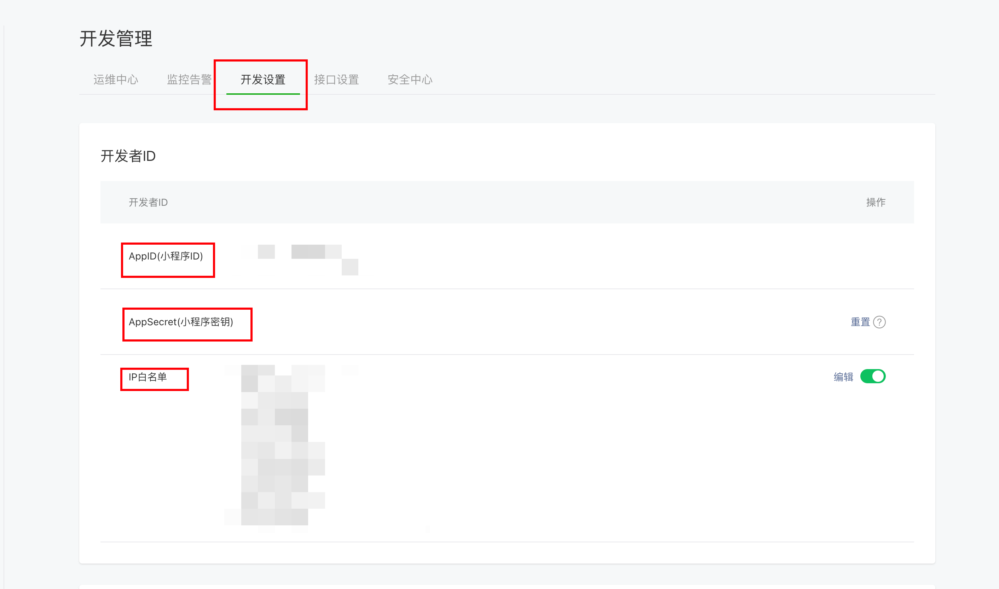
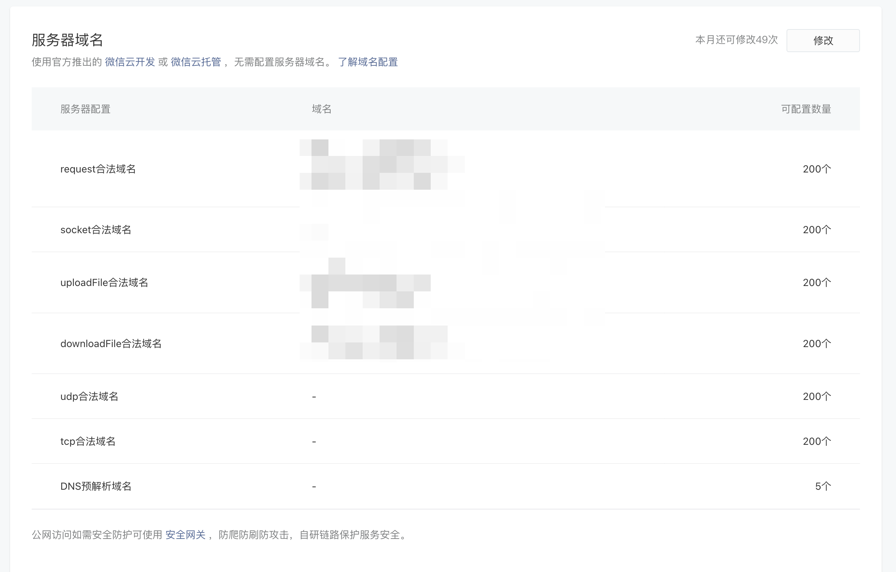
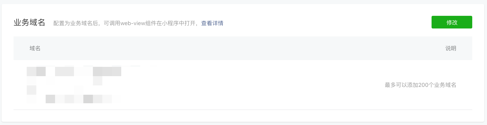
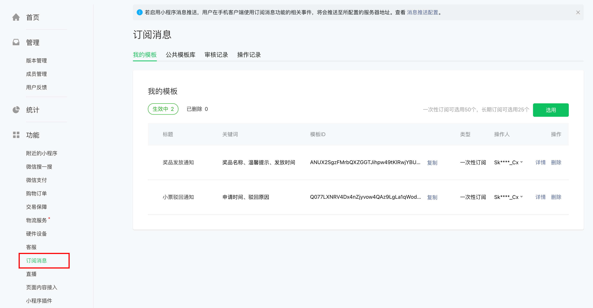
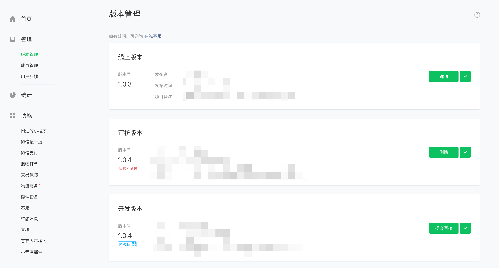
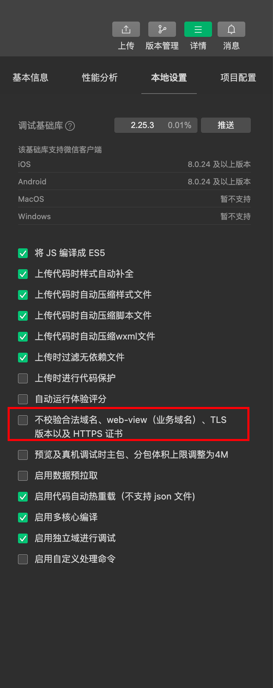

# 微信小程序

## 配置

1. [注册](https://mp.weixin.qq.com/cgi-bin/registermidpage?action=index&lang=zh_CN)小程序
2. [登录](https://mp.weixin.qq.com/)小程序

3. 开发管理配置

    - AppID 和 AppSecret 是服务端请求微信接口使用
    - IP 白名单是服务端部署的 IP 地址
    - request 合法域名配置小程序请求后端接口的地址
    - 业务域名-使用 web-view 组件时跳转的地址要配置

    

    

    

## API 文档

> 如果某些 API 使用不了，可能是不支持个人小程序，那样就要认证为企业小程序

[文档](https://developers.weixin.qq.com/miniprogram/dev/framework/)

## 订阅消息

​ 订阅消息得先在公共模板库中选择好模版，才能在小程序中使用，需要模版 id（前后端都需要），官方现阶段只开放一次性的模版订阅消息，如果需要长期订阅的需要向官方申请。



## 版本提交

-   本地代码上传会自动变为开发版本，可给有权限的用户在微信打开

-   提交审核后为审核版本，审核通过后可手动点击发布成线上版本



## 代码开发

### 请求接口

在本地开发阶段，当没有配置请求域名时，可以勾选不校验合法域名、web-view（业务域名）、TLS

版本以及 HTTPS 证书。这样就可以使用 IP 请求后端接口



### wxs

如果想在`wxml`文件中使用类似`Vue`的计算属性，可以使用`wxs`文件

```javascript
// format.wxs
var statusTextEnum = {
    2: "未开始",
    3: "进行中",
    4: "发奖中",
    5: "已结束",
    6: "已失效"
}

var statusClassEnum = {
    2: "no_start-mark",
    3: "starting-mark",
    4: "awarding-mark",
    5: "no_start-mark"
}

var getStatusText = function (status) {
    return statusTextEnum[status + ""]
}

var getStatusClass = function (status) {
    return statusClassEnum[status + ""]
}

var isIncludes = function (arr, key) {
    return arr.indexOf(key) !== -1
}

module.exports = {
    getStatusText: getStatusText,
    getStatusClass: getStatusClass,
    isIncludes: isIncludes
}
```

```html
// .wxml
<view class="card-item-mark {{format.getStatusClass(item.actStatus)}}">{{format.getStatusText(item.actStatus)}}</view>
<view class="title">{{item.mainTitle}}</view>
<view class="sub-title">{{item.subtitle}}</view>
```
